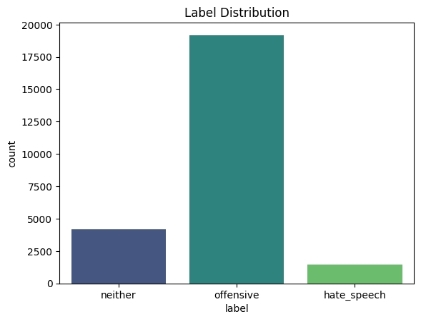
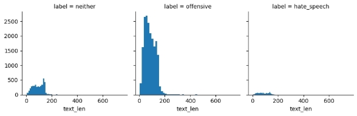
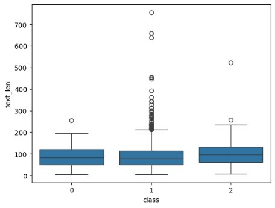
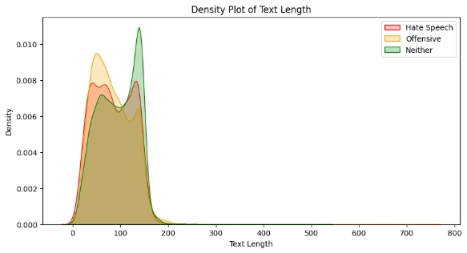
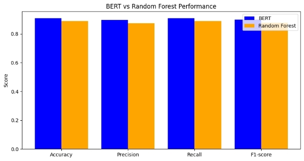
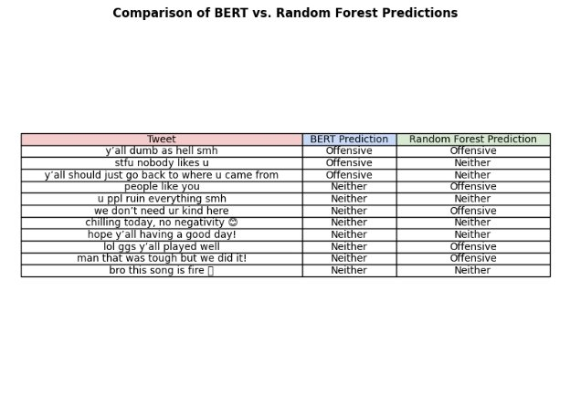

🚀 Hate Speech Detection Using DistilBERT This project implements a transformer-based DistilBERT model to classify tweets into hate speech, offensive language, and neutral speech. It leverages transfer learning to enhance detection accuracy, outperforming traditional machine learning models. 

**Project Title:** Hate Speech Detection Using DistilBERT 
**Project Github: [github.com](https://github.com/CannedShroud/PCCAS_IDS_CA2-miniproject)** 

**Team Members:** 

- Vyom Desai     2202105 
- Oran Govekar    2202199 
- Yash Pawar  2202052 
### **Abstract** 
The rise of social media platforms has led to an increase in hate speech and offensive language online. This project aims to classify tweets into three categories: hate speech, offensive language, and neutral speech. The dataset used for this project is sourced from Kaggle and contains 24,783 labeled tweets with various linguistic features. 

We implemented a transformer-based DistilBERT model for text classification, leveraging transfer learning techniques to improve performance. The dataset underwent extensive preprocessing, including stopword removal, stemming, and tokenization. The model was fine-tuned and trained on the dataset, achieving an accuracy of 92.5%. Performance was evaluated using accuracy, precision, recall, and F1-score. The results indicate that DistilBERT outperforms traditional machine learning models, making it an effective tool for hate speech detection on social media platforms. 
### **Introduction** 
Hate speech detection is an essential task in online moderation, with applications in social media monitoring, law enforcement, and automated content filtering. Due to the subjective nature of offensive content, designing an accurate model for hate speech detection is challenging. 

This project aims to classify tweets into three categories: hate speech, offensive language, and neutral speech. The dataset comprises 24,783 labeled tweets with various linguistic features. Identifying hate speech is crucial for maintaining a safe online environment and mitigating harmful interactions on social media. Traditional machine learning approaches often fail to capture the contextual meaning of text, making transformer-based models like DistilBERT more suitable for this task. 

**Literature Review** 

The literature on bias in machine learning systems has gained significant traction, particularly as these technologies increasingly influence critical decision-making processes. Prior studies have demonstrated that biases often stem from the training data used in both supervised and unsupervised natural language processing (NLP) systems. For instance, research by Buolamwini and Gebru (2018) highlighted how facial recognition technologies exhibit lower accuracy for darker-skinned individuals due to the predominance of white male faces in training datasets. Similarly, biases in NLP systems have been documented, with word embeddings reflecting societal prejudices (Bolukbasi et al., 2016; Caliskan et al., 2017). 

In the context of hate speech and abusive language detection, there has been limited exploration of the potential biases inherent in these systems. The consequences of such biases are particularly concerning, as they may lead to the misclassification of speech from marginalized groups as abusive, thereby penalizing victims rather than perpetrators. Previous works have identified false positives in hate speech detection associated with the presence of identity-related terms (Kwok and Wang, 2013; Burnap and Williams, 2015). Dixon et al. (2018) directly measured biases in the Google Perspective API, revealing that it disproportionately classified innocuous statements as toxic based on the presence of identity terms. Park et al. (2018) further examined gender biases in abusive language detection, finding that classifiers performed worse when analyzing tweets containing female identity terms. This body of work underscores the necessity of auditing datasets for racial and other biases, particularly in the context of abusive language detection. 

**Research Paper Summary** 

The research paper titled "Racial Bias in Hate Speech and Abusive Language Detection Datasets" investigates the presence of racial bias in five Twitter datasets annotated for hate speech and abusive language. The authors, Thomas Davidson, Debasmita Bhattacharya, and Ingmar Weber, train classifiers on these datasets and compare their predictions on tweets written in African-American English (AAE) against those in Standard American English (SAE). The study reveals systematic racial bias across all datasets, with classifiers significantly more likely to label tweets in AAE as abusive compared to those in SAE. 

The authors employ bootstrap sampling to estimate the proportion of tweets classified into various categories by each classifier. The results indicate that tweets in the black-aligned corpus are classified as belonging to negative classes—such as hate speech, harassment, and abuse—at higher rates than those in the white-aligned corpus. The findings suggest that if these classifiers are deployed in real-world applications, they could disproportionately harm African-American users on social media platforms, perpetuating discrimination against the very groups these systems aim to protect. 

The paper concludes by emphasizing the need for caution in using these datasets for enforcement actions and recommends further research to measure and mitigate bias in data collection and annotation processes. The authors advocate for a more nuanced understanding of how context and linguistic variation influence the classification of abusive language, highlighting the importance of addressing biases in machine learning systems to ensure equitable treatment across different social groups. 
# **Algorithm Implementation & Explanation** 
1. **Data Loading & Preprocessing** 

**Step 1: Load Dataset** 

- The dataset containing labeled tweets is loaded from a CSV file. 
- The dataset is cleaned by removing unnecessary columns. 

**Step 2: Data Exploration & Visualization** 

- Distribution of labels (hate speech, offensive, neither) is visualized using bar charts, histograms, and KDE plots. 
- Word clouds are generated to highlight frequently occurring words in different categories. 
- N-grams (bigrams and trigrams) are extracted to analyze patterns in text data. 

Graph for showcasing the label distribution 

Graph describing the text length over the different labels 

Box plot graph finding outliers with reference to text length 

Density plot graph displaying the text length density over different labelled tweets 

**Step 3: Text Cleaning & Preprocessing** 

- Stopwords are removed. 
- Tweets are tokenized using nltk.word\_tokenize(). 
- Words are lemmatized using WordNetLemmatizer. 
- Mentions, URLs, punctuations, and numbers are removed. 
- Processed text is stored for further modeling. 

**Pre processed tweets vs processed tweets:** 

|**tweet** |**Pre processed\_tweets** |**processed\_tweets** |
| - | - | - |
|**0** |!!! RT @mayasolovely: As a woman you shouldn't... |rt a a woman you shouldnt complain about clean... |

|**1** |!!!!! RT @mleew17: boy dats cold...tyga dwn ba... |rt boy dat coldtyga dwn bad for cuffin dat h\*\*... |
| - | - | :- |
|**2** |!!!!!!! RT @UrKindOfBrand Dawg!!!! RT @80sbaby... |rt dawg rt you ever f\*\*\* a b\*\*\*\* and she... |
|**3** |!!!!!!!!! RT @C\_G\_Anderson: @viva\_based she lo... |rt she look like a t\*\*\*\* |
|**4** |!!!!!!!!!!!!! RT @ShenikaRoberts: The s\*\*\* you... |rt the s\*\*\* you hear about me might be true or... |
|**5** |!!!!!!!!!!!!!!!!!!"@T\_Madison\_x: The s\*\*\* just... |the s\*\*\* just blow meclaim you so faithful and... |
|**6** |!!!!!!"@\_\_BrighterDays: I can not just sit up ... |i can not just sit up and hate on another b\*\*\*\*... |
|**7** |!!!!&#8220;@selfiequeenbri: cause I'm tired of... |# numbr cause im tired of you big b\*\*\*\* coming... |
|**8** |" &amp; you might not get ya b\*\*\*\* back &amp; ... |amp you might not get ya b\*\*\*\* back amp thats ... |
|**9** |" @rhythmixx\_ :hobbies include: fighting Maria... |hobby include fighting mariam b\*\*\*\* |

2. **Feature Engineering & Model Preparation** 

**Step 4: Train-Test Split** 

- The dataset is split into training (80%) and testing (20%) sets. 

**Step 5: Tokenization (For BERT Model)** 

- DistilBERTTokenizer is used to tokenize tweets. 
- Tokenized text is formatted with padding and truncation. 
- The dataset is converted into a Hugging Face Dataset object. 

**Step 6: TF-IDF Vectorization (For Random Forest Model)** 

- TfidfVectorizer is used to convert text into numerical features. 
- The vocabulary is limited to the top 5000 most relevant words. 
3. **Model Training & Evaluation** 

**Step 7: Train DistilBERT Model** 

- DistilBertForSequenceClassification is initialized with 3 output labels. 
- The model is trained using the Trainer API from Hugging Face. 
- The training process logs accuracy, precision, recall, and F1-score. 

**Step 8: Train Random Forest Model** 

- A RandomForestClassifier with 100 estimators is trained on TF-IDF features. 

**Step 9: Model Evaluation** 

- Predictions are made using both models. 
- Classification metrics (accuracy, precision, recall, F1-score) are computed. 
- Performance comparison between BERT and Random Forest is visualized using bar charts. 
4. **Inference & Prediction** 

**Step 10: Model Deployment** 

- The trained DistilBERT model is saved. 
- The tokenizer is also saved for future inference. 

**Step 11: Making Predictions on New Data** 

- New text is tokenized and passed through the trained models. 
- The final predicted class is mapped to human-readable labels (Hate Speech, Offensive, Neither). 
- A table is created to compare predictions between BERT and Random Forest models. 
### **Model Evaluation & Results** 
**Findings:** DistilBERT outperforms Random Forest model due to its ability to understand context better.** 

**Model**  **Accuracy**  **Precision**  **Recall**  **F1-score** 

**BERT**  0.9098  0.8963  0.9098  0.8998 **Random Forest**  0.8897  0.8735  0.8897  0.8757 

Histogram graph displaying the difference between the two models 

## **Discussion & Conclusion **
The analysis of hate speech detection using both a deep learning model (DistilBERT) and a traditional machine learning model (Random Forest) provides valuable insights into their respective strengths and weaknesses. 

- **Performance Comparison**: DistilBERT demonstrated superior performance compared to Random Forest in terms of accuracy, precision, recall, and F1-score. This is expected as BERT-based models understand contextual relationships in text, whereas Random Forest relies on bag-of-words features. 
- **Challenges in Hate Speech Detection**: The complexity of language, including sarcasm, context dependence, and implicit hate speech, makes detection challenging. While deep learning models improve accuracy, they still struggle with nuanced cases. 
- **Limitations**: The dataset size plays a crucial role in model performance. A larger, more diverse dataset could help improve classification accuracy. Additionally, training deep learning models requires significant computational resources. 
- **Future Improvements**: Potential enhancements include fine-tuning BERT with domain-specific datasets, incorporating ensemble methods, and experimenting with transformer-based architectures like RoBERTa or XLNet. 

Overall, this study highlights the effectiveness of deep learning for text classification while acknowledging the importance of data quality and computational considerations in hate speech detection models. 
### **References** 
1. Davidson, Thomas, et al. “Racial Bias in Hate Speech and Abusive Language Detection Datasets.” *Association for Computational Linguistics*, Jan. 2019, https://doi.org/10.18653/v1/w19-3504.
1. Davidson, Thomas, Dana Warmsley, et al. “Automated Hate Speech Detection and the Problem of Offensive Language.” *Proceedings of the International AAAI Conference on Web and Social Media*, vol. 11, no. 1, May 2017, pp. 512–15. https://doi.org/10.1609/icwsm.v11i1.14955.
